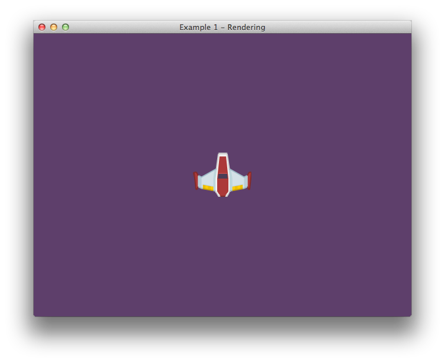

# Example: 1 Rendering

This example provides a basic understanding of how to render objects within your game using an entity system approach.

# Details

## Rendering

To see the details for the rendering functions, please see the following files:

- [`examples/common/include/Components/SpriteComponent.hpp`](../common/include/Components/SpriteComponent.hpp)
- [`examples/common/include/Components/TransformComponent.hpp`](../common/include/Components/TransformComponent.hpp)
- [`examples/common/include/Systems/SpriteRenderingSystem.hpp`](../common/include/Systems/SpriteRenderingSystem.hpp)
- [`examples/common/src/Systems/SpriteRenderingSystem.cpp`](../common/src/Systems/SpriteRenderingSystem.cpp)

## Game scene

To look at the details for how the program is ran and intergrated with the anax library, please see the following files:

- [`main.cpp`](main.cpp)
- [`Game.hpp`](Game.hpp)
- [`Game.cpp`](Game.cpp)