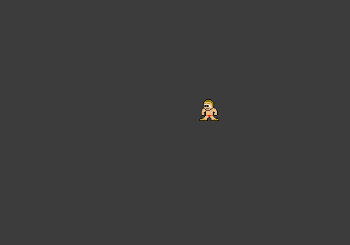

# Example: 3 Movement

This example provides a basic understanding of how to handle movement, along with animating your moving objects.

> **NOTE:**
> 
> There are multiple ways to solve animating your moving object, don't think that the way this example approaches to solve this is the best way.

# Controls

- A to move left
- D to move right
- Space to shoot (shooting does nothing except draw a gun)

# Details

## Movement

To see the details on how the movement works, please see the previous example (the animation example) and following functions/files:

- [`examples/common/include/Components/TransformComponent.hpp`](../common/include/Components/TransformComponent.hpp)
- [`examples/common/include/Components/VelocityComponent.hpp`](../common/include/Components/VelocityComponent.hpp)
- [`examples/common/include/Systems/MovementSystem.hpp`](../common/include/Systems/MovementSystem.hpp)
- [`examples/common/src/Systems/MovementSystem.cpp`](../common/src/Systems/MovementSystem.cpp)
- [`PlayerComponent.hpp`](PlayerComponent.hpp)
- [`PlayerInputSystem.hpp`](PlayerInputSystem.hpp)
- [`PlayerInputSystem.cpp`](PlayerInputSystem.cpp)
- [`Game::onPlayerStateChanged`](Game.cpp#L126)

## Game scene

To look at the details for how the program is ran and intergrated with the anax library, please see the following files:

- [`main.cpp`](main.cpp)
- [`Game.hpp`](Game.hpp)
- [`Game.cpp`](Game.cpp)